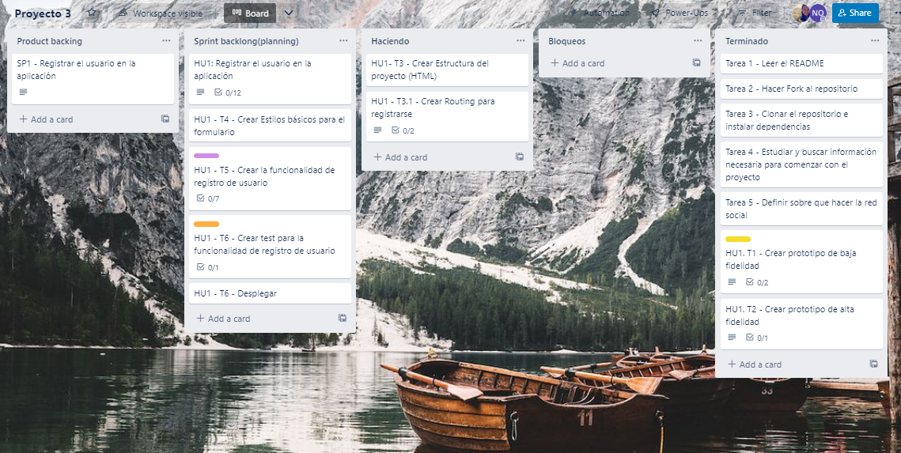
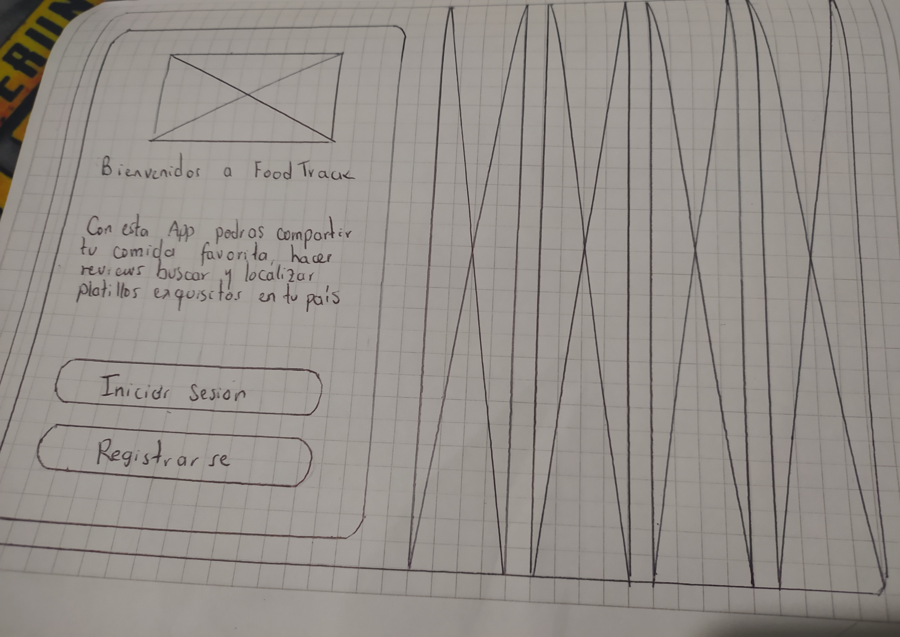

# Food Track

 

## Índice

- [Food Track](#food-track)
  - [Índice](#índice)
  - [1. Preámbulo](#1-preámbulo)
  - [2. Historias de usuario](#2-historias-de-usuario)
  - [3. Diseño de la Interfaz de Usuario](#3-diseño-de-la-interfaz-de-usuario)
    - [Prototipos Versión 1.0](#prototipos-versión-10)
      - [Prototipo de baja fidelidad - Mobile y Desktop](#prototipo-de-baja-fidelidad---mobile-y-desktop)
      - [Prototipo de alta fidelidad](#prototipo-de-alta-fidelidad)

## 1. Preámbulo

Food Track es una App donde podrás compartir tu comida favorita, hacer reviws, buscar y localizar platillos exquisitos en tu pías e incluso consultar la gastronomía de otro país 

## 2. Historias de usuario

## 3. Diseño de la Interfaz de Usuario

### Prototipos Versión 1.0

#### Prototipo de baja fidelidad - Mobile y Desktop

A continuación, se presenta el prototipo de baja fidelidad para mobile

A continuación, se presenta el prototipo de baja fidelidad para desktop

#### Prototipo de alta fidelidad 

[Ver Diseño en Figma](https://www.figma.com/file/Q7c4RZp99IomcpC4nwUNNe/SocialNetwork-FoodTrack?node-id=3%3A56)

